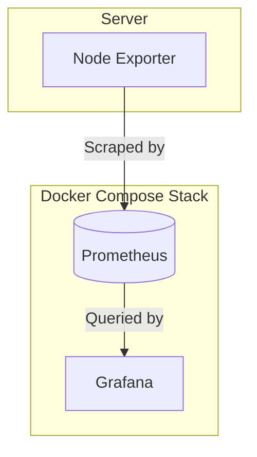
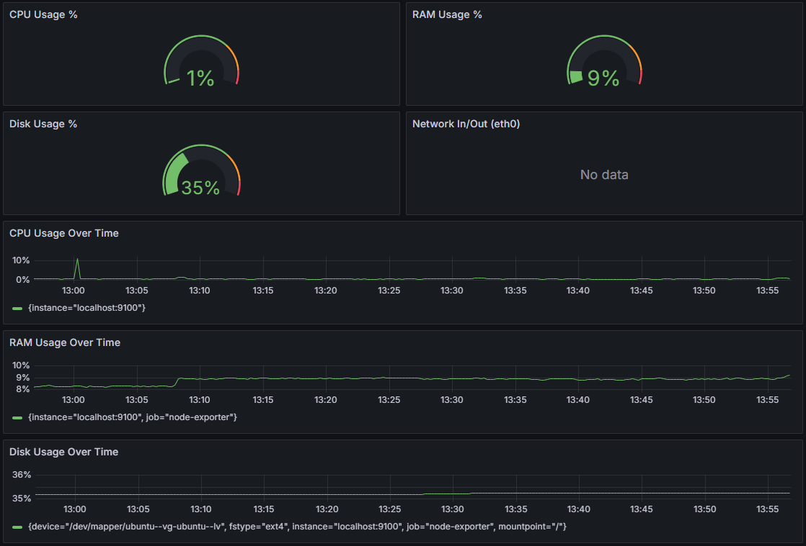
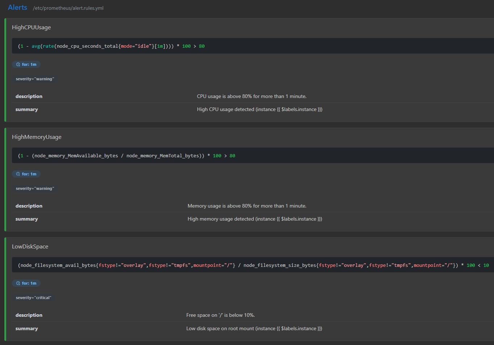

# Monitoring
Bash script that installs and sets up Monitoring tools (Node Exporter, Prometheus, Grafana)
## Technology stack  
<p align="left">
  <a href="https://www.linux.org" target="_blank" rel="noreferrer"></a>
  <a href="https://www.gnu.org/software/bash/" target="_blank" rel="noreferrer"></a>
  <a href="https://www.docker.com/" target="_blank" rel="noreferrer"></a>
  <a href="https://grafana.com/" target="_blank" rel="noreferrer"></a>
  <a href="https://prometheus.io/" target="_blank" rel="noreferrer"></a>
</p>

## Architecture



## How to run

```bash
git clone https://github.com/Kovalenkolex/Monitoring.git
cd Monitoring
chmod +x install.sh
./install.sh
```

Bash script:
1) Installs Docker, Docker-Compose and Node exporter on Server
2) Runs Docker-Compose file with Prometheus and Grafana
3) Creates prometheus.conf with scrape job
4) Creates Dashboard (CPU, RAM, disk I/O)
5) Creates alerts for high load CPU, RAM, low disk space
6) Creates systemd unit for monitoring system


## Alerts (PromQL)

- **High CPU usage**  
Triggers when average CPU usage is above 80% for 1 minute:
```
(1 - avg(rate(node_cpu_seconds_total{mode="idle"}[1m]))) * 100 > 80
```
- **High RAM usage**  
```
(1 - (node_memory_MemAvailable_bytes / node_memory_MemTotal_bytes)) * 100 > 80
```
- **Low disk space**  
```
(node_filesystem_avail_bytes{fstype!="overlay",fstype!="tmpfs",mountpoint="/"} / node_filesystem_size_bytes{fstype!="overlay",fstype!="tmpfs",mountpoint="/"}) * 100 < 10
```

## Dashboard Example

## Alerts Example

